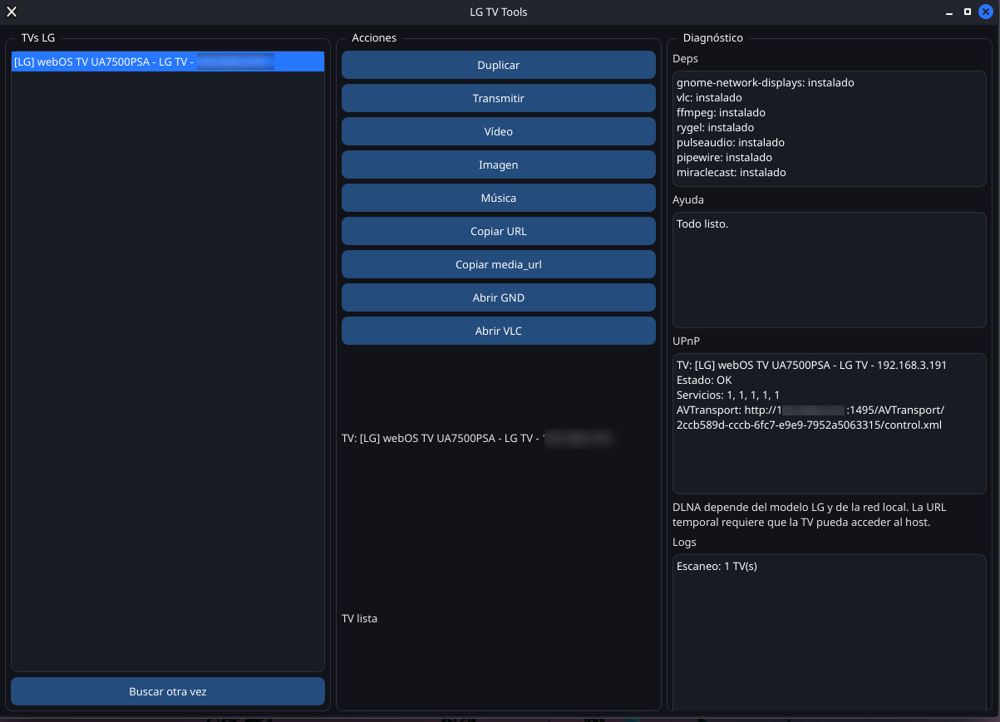

# LG TV Tools

<p align="center">
  
</p>

LG TV Tools is a KDE Plasma utility for Kali Linux that discovers LG televisions on the local network and provides a compact workflow for screen mirroring, desktop casting, and media handoff.

## Author

- Author: Reynaldo Rodríguez
- User: reyam
- Email: rey.amado8509@gmail.com

## Features

- PyQt6 desktop interface
- Automatic SSDP/DLNA discovery
- LG TV list with live selection
- Mirroring and desktop casting launchers
- Video, image, and music handoff
- `gnome-network-displays` launcher
- `VLC` launcher
- Installed-dependency detection
- Diagnostic logging
- KDE launcher integration via `.desktop`
- User-level install and uninstall scripts

## Requirements

- Python 3.10 or newer
- PyQt6
- Local network access to the LG TV

## Detected dependencies

The application checks for:

- `gnome-network-displays`
- `VLC`
- `ffmpeg`
- `rygel`
- `pulseaudio`
- `pipewire`
- `miraclecast`

If any of these are missing, the UI shows a short installation hint for Kali Linux.

## Development run

```bash
python3 -m pip install --user -e .
python3 -m lgtvtools.app
```

## KDE integration

Install the user-level launcher:

```bash
bash scripts/install.sh
```

Remove the user-level launcher:

```bash
bash scripts/uninstall.sh
```

The installer places:

- a wrapper in `~/.local/bin/lg-tv-tools`
- a `.desktop` file in `~/.local/share/applications/lg-tv-tools.desktop`
- an icon in `~/.local/share/lg-tv-tools/icons/app.svg`

## Logging

Runtime logs are written to:

```text
~/.local/share/lg-tv-tools/logs/lg-tv-tools.log
```

## Media flow

When a file is selected, the app:

- publishes a temporary local HTTP URL
- tries to send the media through UPnP when the TV exposes a compatible service
- falls back to VLC or the default application when direct playback is not available

This keeps the workflow usable while leaving room for TV-specific DLNA refinement later.

The temporary URL is only useful if the LG TV can reach the host on the local network. If client isolation or firewall rules block access, direct playback will fail even when discovery succeeds.

## Packaging

A local Debian package can be built with:

```bash
bash scripts/build_deb.sh
```

Release validation can be run with:

```bash
bash scripts/smoke_test.sh
```

If you publish signed releases, sign the `.deb` with GPG and keep the release version fixed before tagging.

Current release target: `0.2.0`
Release signing key: `88228B125455C0B7644DB1A9320D6B571195D41C`

## Limitations

- Mirroring and casting depend on the installed backend and the TV model.
- UPnP/DLNA behavior varies between LG models and firmware versions.
- The application avoids automatic system changes and keeps all user-facing integration local by default.
